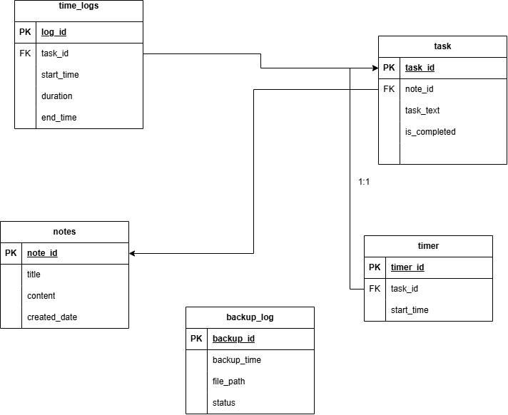
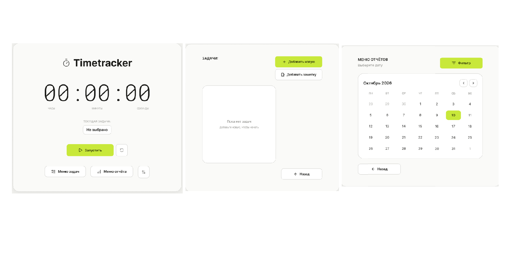

# **1. ОБЩИЕ СВЕДЕНИЯ**
### **Название продукта:** Timetracker
### **Краткое содержание:** Приложение представляет собой трекер для отсчета времени. Предназначенный для учета времени, потраченного на решение задач и проектов. Решает проблему хаотичного распределения времен, давая отчет сколько времени и куда было потрачено
### **Целевая аудитория:** Студенты, которые хотят учитывать время на учебу.

# **2.ФУНКЦИОНАЛЬНЫЕ ТРЕБОВАНИЯ**

### **Пользователь в приложении может:**
### 1)Поставить таймер (пауза/старт/стоп) с записью в бд
### 2)Получить отчет о суммарном времени за определенный период
### 3)Поставить заметку
### 4)Отфильтровать отчет по датам
### 5)Создавать записи для задачи, читать, обновлять и удалять их

# **3.НЕФУНКЦИОНАЛЬНЫЕ ТРЕБОВАНИЯ**
### **1)Язык интерфейса:** русский
### **2)Производительность:** время отклика интерфейса не более 1 секунды при стандартных операциях
### **3)Хранение данных:** локально в бд SQlite, без использования сети
### **4)Защита от ошибок:** Нельзя удалить запись задач уже с существующими записями, нельзя устанавливать отрицательное значиения в таймере (без подтверждения)
### **5)Инициализация БД:** при первом запуске приложение само создает таблицы из встроенного SQL-скрипта

# **4.МОДЕЛЬ ДАННЫХ (ER-диаграмма)**

## Схема разбита на 5 таблиц, чтобы приложение работало без ошибок, а данные не путались:
### notes и task: Они разделены, потому что в одной заметке может быть много разных заданий. Если их писать в одну кучу, база данных бы постоянно дублировала названия предметов
### time_logs: Связана только с задачей. В ней записываеться название предмета, потому что программа сама по цепочке видит через задачу, к какой заметке относится это время. Это экономит место на компьютере
### timer: Вынесен отдельно, чтобы защитить данные. Пока человек выполняет задачу, время тикает здесь. Если компьютер резко выключится, запущенный таймер не пропадет. А когда нажимается кнопку стоп, время считается и переносится в общую историю time_logs
### backup_log: Нужен для безопасности. Он никак не связан с задачами или таймером, он записывает, когда программа сделала резервную копию всей базы данных, чтобы история подготовки не удалилась

# **5.МАКЕТ ИНТЕРФЕЙСА**

## Логика переходов между экранами
### **Главный экран (Таймер)** ➔ при нажатии на кнопку **Меню задач** ➔ Переход на **Экран задач**
### **Главный экран (Таймер)** ➔ при нажатии на кнопку **Меню отчёта** ➔ Переход на **Экран отчётов**
### **Экран задач** ➔ при нажатии на кнопку **Назад** ➔ Возврат на **Главный экран (Таймер)**
### **Экран отчётов** ➔ при нажатии на кнопку **Назад**➔ Возврат на **Главный экран (Таймер)**

## Описание основных элементов управления

## **Главный экран (Таймер)**
### **Цифровое табло:** Отображает текущее время сессии в формате час/минута/секунда
### **Кнопка "Не выбрано / Выбор задачи":** Выпадающий список для привязки таймера к конкретной задаче
### **Кнопка "Старт / Пауза":** Запуск и приостановка отсчета времени
### **Кнопка сброса (Рядом с кнопкой "старт" ):** Сброс текущего таймера без сохранения
### **Нижняя навигация:** Кнопки перехода в меню задач и отчётов

## **Меню задач:**
### **Кнопка "Добавить новую":** Открывает окно для создания новой задачи.
### **Кнопка  "Добавить заметку":** Позволяет прикрепить текстовую заметку к выбранной задаче
### **Список задач:** Окно, где отображается список текущих задач 
### **Кнопка "Назад":** Возвращает на главный экран

## **Меню отчётов:**
### **Кнопка "Фильтр":** Применяет выбранные временные диапазоны для генерации отчета
### **Календарь:** Сетка дней месяца для выбора конкретной даты или диапазона
### **Стрелки навигации < и >:** Переключение между месяцами
### **Кнопка "Назад":** Возвращение на главный экран

# **6.СЦЕНАРИЙ ИСПОЛЬЗОВАНИЯ (Use Cases)**
## 1 Сценарий: Фильтрация отчета по датам
### Актёр: Пользователь
### Предусловие: Приложением пользовались некоторе время.
### Основной поток:
### 1)Пользователь переходит в меню отчета
### 2)Пользователь вводить диапазон дат за месяц
### 3)Система собирает задачи которые попадают в этот диапазон
### 5)Система предоставляет отфильтрованный отчет пользователю
### Альтернативный поток: Пользователь вводит некорректный диапазон, система выдает ошибку

## 2 Сценарий: Получения отчета по задачам за месяц
### Актер: Пользователь
### Предусловие: Системой пользовались уже месяц, в бд есть сохранненые записи
### Основной поток:
### 1)Пользователь переходит в меню отчета
### 2)Пользователь выбирает и вводит период для отчета
### 3)Пользователь нажимает "сделать отчет"
### 4)Система собирает общее количество времени для каждого задания за этот период
### 5)Система предоставляет отчет пользователю на экране
### Альтернативный поток: В заданном периоде нет записей, система выдает сообщение об отсутствии записей

## 3 сценарий: Создание новой задачи
### Актер: Пользователь
### Предусловие: Пользователь находиться в главном меню приложения
### Основной поток:
### 1)Пользователь переходит в меню задач
### 2)Пользователь нажимает кнопку "создать задачу"
### 3)Пользователь вводит название задачи
### 4)Система создает задачу и выводит его в меню
### Альтернативный поток: Пользователь не дает название задаче, система выдает ошибку и выдает предупреждение

## 4 Cценарий: Создание заметки
### Актер: Пользователь
### Предусловие: В приложении есть хотя бы 1 задание
### Основной поток:
### 1)Пользователь переходит в меню задач
### 2)Пользователь выбирает нужную задачу
### 3)Пользователь нажимает кнопку "создать новую заметку"
### 4)Система добавляет заметку к задаче
### Альтернативный поток: ничего не вводит, система выдает ошибку и выдает предупреждение

## 5 Сценарий: Активация таймера
### Актер: Пользователь
### Предусловие: Пользователь выбрал конкретную задачу
### Основной поток:
### 1)Пользователь выбирает задачу
### 2)Пользователь нажимает на кнопку "создать таймер"
### 3)Пользователь настраивает таймер
### 4)Пользователь нажимает кнопку "старт"
### 5)Таймер начинает работать

# **7. КРИТЕРИИ ПРИЁМКИ**
### [] Запрет на создание пустых полей
### [] Защита при сбое
### [] Работоспособность интерфейса
### [] Правильная работа таймера
### [] Правильная фильтрация за период
### [] Корректное отображение интерфейса
### [] Быстрый отклик при стандартных операциях 1 сек
### [] Правильные данные отчета

